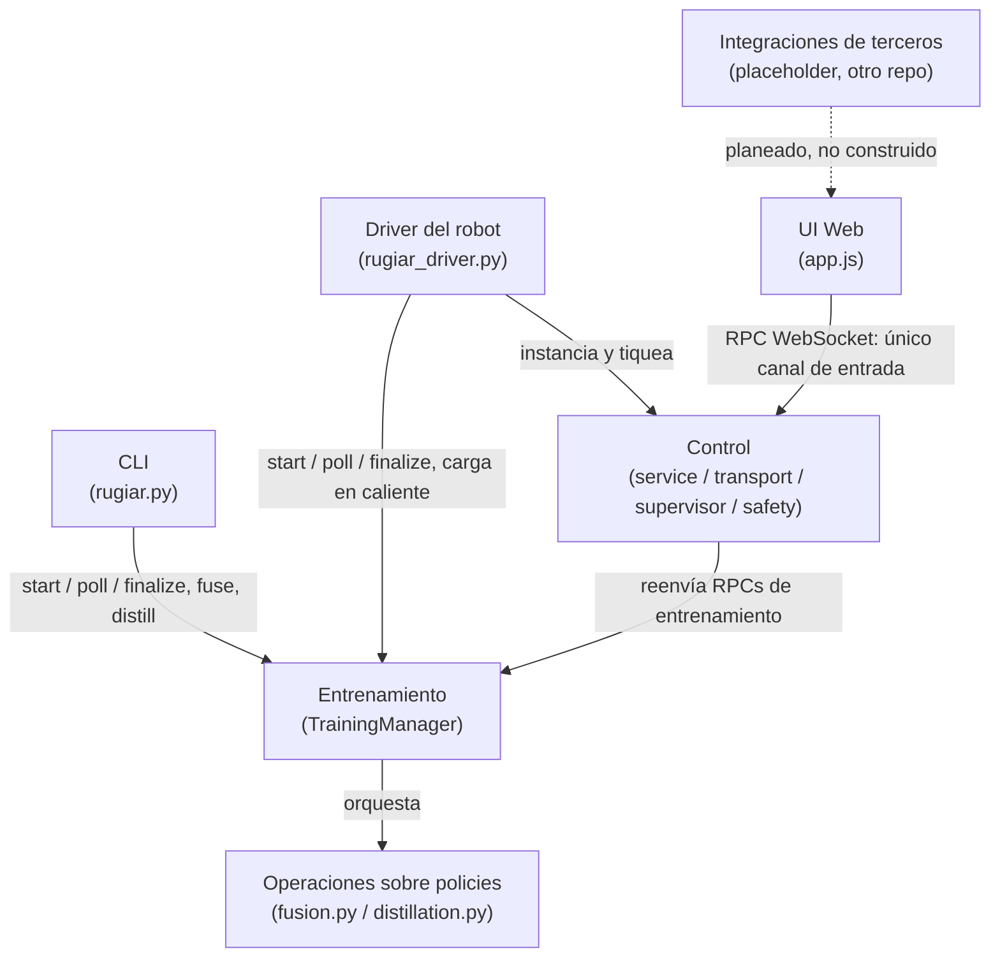

# RUgiar — Guía rápida para colaboradores

Documento de orientación: 15 minutos de lectura para entender dónde estás parado y dónde tocar.
No es exhaustivo a propósito. Cuando necesites profundidad:

- [`docs/index.html`](index.html) — el material didáctico completo, desde cero (motores, control PD, RL, pipeline de entrenamiento).
- [`legged_gym/control/ARCHITECTURE.md`](../legged_gym/control/ARCHITECTURE.md) — la arquitectura real: quién llama a quién, invariantes, riesgos de colisión entre áreas.
- `.claude/skills/rugiar/SKILL.md` — uso diario del CLI y del driver.

---

## 1. Qué es RUgiar

**RobotUniversityGiar (RUgiar)** es un fork de `unitree_rl_gym` sobre Genesis/Isaac Gym que cubre el ciclo de vida completo de una policy para humanoides y cuadrúpedos Unitree (principalmente el G1):

**entrenarla → transformarla (fusionar o destilar) → manejar con ella un robot real o simulado, en vivo y bajo supervisión de un operador.**

El nombre se lee "RU-giar" y suena a *rugir* — apropiado para un proyecto cuyo objetivo final es que algo con patas salga a caminar solo. Dicho una vez y seguimos.

Lo que distingue a este fork del upstream es la capa `legged_gym/control/`: permite cargar N policies entrenadas, cambiar entre ellas en caliente con un cross-fade suave, filtrar cada cambio por una compuerta de seguridad, y manejar todo eso desde una página web, desde un cliente propio, o eventualmente desde una decisión autónoma — con el mismo código en simulación y en hardware real.

---

## 2. Las 7 áreas

El proyecto se parte en siete áreas siguiendo el ciclo de vida de una policy. Están pensadas para trabajarse **en paralelo**, por eso las fronteras importan.

| # | Área | Qué hace | Dónde vive |
|---|---|---|---|
| 1 | **Entrenamiento** | Lanza y sigue jobs de PPO (subproceso local o Kaggle). Dueña del catálogo de policies. | `legged_gym/control/training.py` |
| 2 | **Operaciones sobre policies** | Post-entrenamiento: fusión de pesos y clonación de comportamiento (destilación). | `fusion.py`, `distillation.py` |
| 3 | **Control** | El motor del robot en vivo: cambio de policy, seguridad, transporte WebSocket, adapters sim/real. | `service.py`, `transport.py`, `supervisor.py`, `safety.py`, `adapter.py`, `policy.py` |
| 4 | **UI Web** | El cliente de navegador para Control, más los formularios de Entrenar / Fusionar / Destilar. | `web/index.html`, `web/app.js` |
| 5 | **CLI** | `rugiar` — frontend de línea de comandos sobre Entrenamiento y Operaciones, **solo** sobre eso. | `legged_gym/cli/rugiar.py` |
| 6 | **Driver del robot** | El proceso que cablea Control + adapter + simulador (o robot real) y corre el loop principal. | `legged_gym/scripts/rugiar_driver.py`, `rugiar_driver_gaze.py` |
| 7 | **Integraciones de terceros** | Placeholder. Un colaborador desarrolla retargeting de captura de movimiento humano en otro repo; entrará probablemente por la UI Web. | (todavía nada) |

Notas rápidas por área:

- **Entrenamiento** produce carpetas `policies/<nombre>/` en disco. Ese directorio es el contrato con el resto del sistema.
- **Operaciones** lee y reescribe esas mismas carpetas *sin entrenar*. Dos operaciones con modelos de ejecución distintos: **fusión** es síncrona, en proceso, y exige `train_checkpoint.pt` en todas las fuentes; **destilación** es un subproceso asíncrono y solo necesita el `checkpoint.pt` del maestro. Por eso policies externas como `stable` se pueden destilar pero nunca fusionar — es una limitación de diseño, no un bug.
- **Control** no se instancia solo: lo arma y lo tiquea el Driver.
- **UI Web** es una hoja del árbol: no la llama nadie, solo habla WebSocket contra Control. Sin build step, a propósito (es material de curso).
- **CLI** no toca Control ni el Driver. Cero imports. Es la frontera más limpia del repo.
- **Driver** son dos scripts independientes (`g1` y `g1_gaze`), no dos modos de uno solo: Genesis no puede reconstruir su escena en proceso, así que cambiar de familia de tareas relanza el proceso.

---

## 3. Cómo está organizado para que no se pisen

Cuatro decisiones sostienen el paralelismo. Si entendés estas cuatro, entendés por qué el código está partido así.

**a) Cada área expone una interfaz, no sus internals.**
Control no mete la mano en `training.py`: tiene un `TrainingManager` y reenvía sus métodos públicos 1:1. El CLI hace lo mismo (mapeo argv→kwargs y nada más). La UI Web no tiene otro camino de entrada que los 30 métodos RPC del WebSocket. Cuando una PR empieza a saltearse esas interfaces, eso es lo que hay que discutir en review — antes que el estilo del código.

**b) Responsabilidad única dentro de Control.**
Control no es una clase grande: son piezas chicas de una sola responsabilidad cada una — `PolicySupervisor` (qué policy está activa y el ramp de 15 ticks al cambiar), `SafetyGovernor` (caídas, NaN, compuerta de los cambios pendientes), `ControlServer` (transporte), `SimAdapter`/`RealAdapter` (ciclo de vida del robot), `ControlService` (la única superficie pública que las pega). Podés reemplazar cualquiera sin tocar las demás.

**c) Inversión de dependencias en el borde sim/real.**
El resto del sistema depende del protocolo `RobotAdapter`, no de Genesis ni del SDK de Unitree. `RealAdapter` vive en un paquete aparte (`deploy_real/`) justo para que `legged_gym/control/` se pueda instalar sin `unitree_sdk2`. Ese es el motivo por el cual pasar de simulación a robot real no debería requerir reescribir nada arriba.

**d) Un solo canal de concurrencia.**
Hay dos hilos: el de simulación (el loop del Driver) y el del socket (asyncio de uvicorn). Los comandos van async→sync por una `Queue` que se drena una vez por tick; el estado va sync→async por snapshots con lock. **Toda** llamada a `ControlService` pasa por esa cola, salvo cuatro atajos baratos que solo setean flags (`request_switch`, `pause`, `resume`, `estop`). Este es el invariante más importante del repo: agregar un quinto atajo sin verificar que cuesta menos de 1 ms y no toca estado por tick es la forma más probable de meter una race.

**Dónde el diseño todavía no acompaña** (útil saberlo antes de empezar, no es crítica):

- `training.py` (~1520 líneas) mezcla seis responsabilidades — es la mayor superficie de conflicto de merge del repo.
- `web/app.js` (~3640 líneas) tiene ~50 globales de módulo, sin registro de paneles ni convención de render por panel. Dos personas agregando paneles al mismo tiempo van a chocar. Antes de agregar uno: fijate si tu estado puede vivir en una clausura local en vez de una global nueva.

---

## 4. A dónde ir según lo que vayas a tocar

| Si vas a trabajar en… | Empezá por | Y además |
|---|---|---|
| **Entrenamiento** | `legged_gym/control/training.py` (`start`, `poll`, `finalize_policy`, catálogo) | `scripts/web_train.py`; ojo con los esquemas de `result.json`/`progress.json` — solo están documentados en comentarios. `poll()` **no** es thread-safe. |
| **Operaciones sobre policies** | `fusion.py` / `distillation.py` | La orquestación está en `training.py` (`fuse_policies()`, `start_distillation()`): coordiná con quien tenga trabajo en vuelo ahí. |
| **Control** | `ARCHITECTURE.md` §3 **completo**, después `service.py` | El diagrama de secuencia del round-trip y la nota de concurrencia son lectura obligatoria antes de la primera línea. |
| **UI Web** | `web/app.js`: `send()`, `call()`, `applyStatus()` | `applyStatus()` es el render central del que cuelga casi todo panel. Reusá `makeSortable()` en vez de copiarlo. |
| **CLI** | `legged_gym/cli/rugiar.py` | Lo valioso a preservar es la *ausencia* de imports de Control/Driver. |
| **Driver del robot** | `scripts/rugiar_driver.py` | Cualquier cambio en un helper compartido va también en `rugiar_driver_gaze.py`; `test_driver_family_parity.py` lo verifica por AST y falla en CI. |
| **Hardware real** | `deploy_real/real_adapter.py` | Portado con cuidado pero **nunca probado en un robot físico**. Orden de motores, convención del cuaternión de la IMU y match de escalas solo los puede verificar una persona con el G1 delante. |
| **Integraciones de terceros** | Nada todavía | Hablá con el colaborador que está haciendo retargeting antes de escribir código que asuma un contrato de integración. |
| **Solo entender el sistema** | [`docs/index.html`](index.html) | Desde cero, con demo interactiva. |

---

## 5. El mapa en un diagrama

Leído en una frase: **el Driver es el único que arma Control; Control es la única puerta de entrada de la UI; el CLI y la UI llegan a Entrenamiento por caminos distintos que nunca se cruzan; y todo lo que las áreas comparten en disco son las carpetas `policies/<nombre>/`.**
