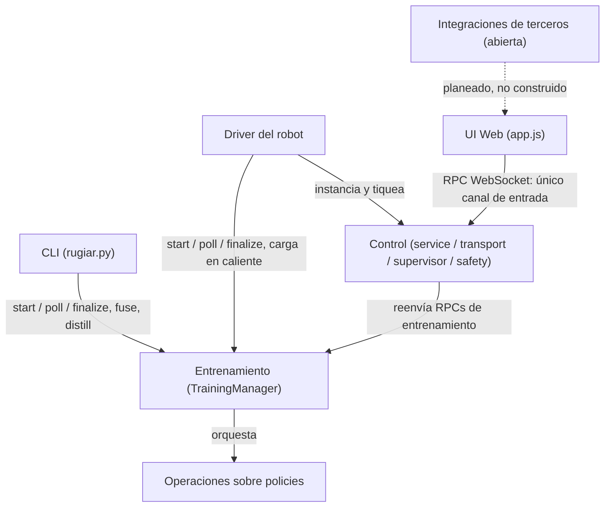

<!--
Source of truth for docs/Sumate_a_RUgiar.pdf.
This file was reconstructed from the existing (never-committed) PDF on 2026-08-19 —
the PDF predates git tracking of this doc, built live and shared directly.
Blocks marked "⚠ UPDATE NEEDED" are places where the repo has moved since the PDF
was made (Aug 12) and this file has NOT been corrected yet — confirm before regenerating the PDF.
-->

# Sumate a RUgiar.

*ROBOT UNIVERSITY GIAR · COMUNICADO ABIERTO*

## Unamos nuestro conocimiento y energía.

Un fork de `unitree_rl_gym` que entrena, transforma y maneja policies de RL para
humanoides Unitree — con una base sólida ya funcionando y siete frentes abiertos
esperando a la persona indicada. Sí, vos, vos que estás leyendo esto.

`7 áreas · elegí la tuya` &nbsp; `Ramas cortas, PR simple` &nbsp; `Arrancás hoy`

> Lo que hace atractivo este momento para colaborar es que RUgiar recién está arrancando
> en serio. Hay una base sólida — entrenamiento funcionando, control en vivo funcionando,
> las partes críticas ya cubiertas — pero todas las áreas tienen techo, desde la UI web hasta
> la integración con captura de movimiento humano. Quien entre ahora tiene margen real
> para dejar su huella, no para retocar los bordes de algo ya cerrado.
>
> Este documento es la puerta de entrada, no el manual completo. Profundidad cuando la
> necesites: el material didáctico completo, la arquitectura entera, y el skill `rugiar` para el
> uso diario del CLI y el driver.

---

## Elegí una y tomá la posta

*LAS 7 ÁREAS*

El proyecto se divide siguiendo el ciclo de vida de una policy: entrenarla → transformarla →
manejar con ella un robot. Pensadas para trabajarse en paralelo — cada una tiene dueño
potencial: vos.

### §1 · Entrenamiento
Mejorar cómo se lanzan y siguen los jobs de RL, local o en Kaggle, y el catálogo de policies
resultante.
`legged_gym/control/training.py`

### §2 · Operaciones sobre policies
Fusión de pesos, destilación / behavior cloning — hacer más policies a partir de las que ya
existen.
`fusion.py` · `distillation.py`

### §3 · Control
El motor del robot en vivo: cambio de policy, seguridad, transporte, adapters sim/real.
`service.py` · `transport.py` · `supervisor.py` · `safety.py`
ref: `examples/joystick_controller.py`

### §4 · UI Web
El panel de control en el navegador — hoy el área con más superficie visible y más margen
de crecimiento.
`web/index.html` · `web/app.js`

### §5 · CLI
La herramienta de terminal — entrenar, fusionar, destilar sin abrir un navegador.
`legged_gym/cli/rugiar.py`

### §6 · Driver del robot
El proceso que arma todo y corre el loop del robot, en simulación o real.
`rugiar_driver.py` · `rugiar_driver_gaze.py`

### §7 · shipped — Motion library, de captura de movimiento a policy entrenada
Lo que esta sección pedía como "terreno sin dueño" ya se construyó y está validado en vivo:
un pipeline completo que va de un dataset de motion capture externo
([g1-moves](https://huggingface.co/datasets/exptech/g1-moves), vía
`process_reference_motion_mjlab.py`) a una policy G1 full-body entrenada imitando ese
movimiento, con overlay "ghost" del movimiento de referencia superpuesto al robot en vivo en
viser, selector de clips y panel de Create Policy conscientes de mjlab en la control web, un
training backend real para mjlab (no un wrapper — puerto propio de `mjlab_train.py`), y un
panel de rewards con las 9 variables de tracking de este mundo (`motion_body_pos`,
`motion_body_ori`, etc.), streameando en vivo mientras el robot imita.
`legged_gym/scripts/process_reference_motion_mjlab.py` · `legged_gym/scripts/mjlab_train.py` ·
`docs/motion_imitation_integration.md` · `docs/mjlab_training_contract.md`

> **Frontera todavía abierta acá:** el pipeline de arriba corre sobre Genesis/mjlab (CPU/Metal,
> sin depender de NVIDIA). El stack de simuladores NVIDIA (Isaac Lab / Isaac Gym) para este
> mismo mundo de motion imitation lo está avanzando otro equipo, integración pendiente.
> Más allá de eso: sumar nuevas fuentes de movimiento — video propio digitalizado, otros
> datasets de motion capture, captura desde el robot mismo — sigue siendo terreno real para
> quien se sume. `tu nombre acá`

> **Antes de arrancar:** Entrenamiento produce carpetas `policies/<nombre>/` — ese
> directorio es el contrato con el resto del sistema. Control no se instancia solo, lo arma el
> Driver. La UI Web solo habla WebSocket contra Control, sin otro camino de entrada. El CLI
> no toca Control ni el Driver — cero imports, la frontera más limpia del repo.

---

## Simulación y robot real, sin reescribir nada

*POR QUÉ ESTÁ ARMADO ASÍ*

El sistema depende de un protocolo, no de Genesis ni del SDK de Unitree — por eso pasar
de simulación a robot real no debería requerir reescribir nada arriba.

> Dos cosas para saber antes de arrancar, no para frenarte: `training.py` hace bastante hoy —
> si ves una separación natural, proponela. Y `web/app.js` todavía no tiene un registro de
> paneles — si vas a sumar uno, avisá en el equipo para coordinar con quien esté tocando
> otro al mismo tiempo.

---

## Política de branching

*CÓMO TRABAJAMOS*

Lo más laxo posible. Dos reglas duras, el resto es criterio de cada uno.

**Regla dura — Nadie pisa main directo.** Todo cambio entra por rama propia.

**Regla dura — Todo se mergea por PR.** Aunque la revises vos mismo — deja registro de qué
cambió y por qué.

El resto son sugerencias, no obligaciones:

- Usá nombres de rama y mensajes de commit significativos — que cuenten algo del cambio,
  no `fix` / `wip` / `cambios`. Preferentemente en inglés, pero no es lo primordial: que se
  entienda importa más que el idioma.
- Correr los tests ayuda (`pytest tests/`, con `SIMULATOR` según tu entorno — genesis en
  Mac/CPU, puede ser isaacgym / isaaclab en otro setup), y agregar tests de lo que hagas es
  aconsejado — no exigido.
- Como norte de diseño tratamos de seguir SOLID, DRY y LEAN — no como dogma, sino
  porque es lo que permite que varias personas toquen esto en paralelo sin pisarse.
- Si tu cambio cruza dos áreas, avisar en la PR quién coordinó qué ayuda — de nuevo, criterio,
  no regla.

> Punto de partida laxo a propósito. Si el equipo crece o algo empieza a doler, se ajusta.

---

## Cómo se conectan las siete áreas

*EL MAPA*



Leído en una frase: el Driver es el único que arma Control; Control es la única puerta de
entrada de la UI; el CLI y la UI llegan a Entrenamiento por caminos distintos que nunca se
cruzan; y todo lo que las áreas comparten en disco son las carpetas `policies/<nombre>/`.

---

## A dónde ir según lo que vayas a tocar

*REFERENCIA RÁPIDA*

| Si vas a… | Empezá por | Y además |
|---|---|---|
| Entrenamiento | `training.py` | `result.json` / `progress.json` solo documentados en comentarios — buena primera mejora. |
| Operaciones sobre policies | `fusion.py` / `distillation.py` | Orquestación en `training.py` — coordiná con quien esté ahí. |
| Control | `ARCHITECTURE.md` §3, después `service.py` | Diagrama de secuencia y nota de concurrencia: lectura obligatoria antes de la primera línea. |
| UI Web | `send()`, `call()`, `applyStatus()` | Más espacio para crecer, más impacto visible, hoy. |
| CLI | `rugiar.py` | Preservá la ausencia de imports de Control/Driver. |
| Driver del robot | `rugiar_driver.py` | Cambios en helpers compartidos van también a `_gaze.py`. |
| Hardware real | `deploy_real/real_adapter.py` | Sin probar en robot físico — si tenés acceso a un G1, sos quien puede cerrar esa brecha. |
| Integraciones de terceros | Nada todavía | Hablá con quien hace el retargeting, o proponé vos el contrato. |

---

## Instalación, según tu sistema

*ANTES DE TU PRIMER PR*

Tres caminos según de dónde vengas: nativo en Mac/Linux, un solo comando con Docker en
cualquier sistema (incluido Windows), o Kaggle si no tenés GPU propia y querés entrenar en
la nube.

### macOS / Linux — nativo

Clonás, armás un entorno virtual de Python 3.12 e instalás las dependencias. Sin GPU no hay
problema — en Apple Silicon corre sobre CPU o Metal según lo que Genesis detecte.

```bash
# 1. clonar y entrar al repo
git clone https://github.com/josetabuyo/RobotUniversityGiar.git
cd RobotUniversityGiar

# 2. instalador de un comando (hace todo lo de abajo por vos)
./install.sh
# agregá --with-kaggle si también vas a entrenar en Kaggle:
./install.sh --with-kaggle

# 3. cada terminal nueva necesita esto:
source .venv/bin/activate
export SIMULATOR=genesis
```

> `install.sh` es nuevo: hace exactamente los pasos manuales que antes vivían solo en el
> README (venv, los `pip install` en el orden correcto, `pip install -e .`) — instalación
> equivalente, un comando menos para copiar mal. Si preferís los pasos manuales o algo falla,
> están en `README.md` §2.

### Docker Compose — más simple, cualquier sistema (recomendado)

Si no querés lidiar con Python, venvs ni versiones de dependencias — este camino ya es el
"instalador simplificado": no hay pip, no hay venv, funciona igual en Mac, Linux y Windows
(con Docker Desktop) porque todo corre adentro del contenedor.

```bash
# 1. poné tus checkpoints .pt en ./policies/ (ej: ./policies/motion.pt)
# 2. copiá el archivo de entorno de ejemplo
cp .env.sample .env

# 3. build y run — funciona en amd64 y arm64/Apple Silicon
docker compose up --build
# abrí http://localhost:9006       (visor 3D viser)
# y      http://localhost:9013      (control web unificado)
```

Requiere Docker Desktop instalado (Mac, Windows) o Docker Engine (Linux). Con GPU NVIDIA
en Linux, sumá el overlay:

```bash
GENESIS_BACKEND=cuda docker compose -f docker-compose.yml -f docker-compose.gpu.yml up --build
```

### Windows — WSL2 o Docker

No hay instalador nativo de PowerShell para el camino Python/venv — no está probado en
Windows puro y Docker ya cubre ese caso sin fricción (ver arriba). Dos opciones reales:

- La más simple: Docker Desktop en Windows (usa WSL2 como backend por dentro, no hace
  falta configurarlo a mano) y seguís el bloque de Docker Compose de arriba tal cual.
- Si querés Python nativo: instalá WSL2 con Ubuntu (`wsl --install` en PowerShell como
  administrador, después reiniciar), abrís una terminal de Ubuntu y seguís el bloque
  "macOS / Linux — nativo" de arriba sin cambios — es una terminal Linux real, mismos
  comandos, mismo `install.sh`.

> **¿Cuál elegir?** Si nunca tocaste Python o entornos virtuales: Docker. Si vas a tocar código
> de entrenamiento y querés iterar rápido sin reconstruir una imagen cada vez: nativo
> (Mac/Linux, o WSL2 en Windows).

---

## Kaggle: GPU gratis sin tener una propia

*ENTRENAMIENTO EN LA NUBE*

Entrenamiento (§1) puede lanzar jobs de RL en un kernel de Kaggle en vez de tu máquina
local. Configuración de una sola vez — después, todo `--backend kaggle` funciona directo.

1. Creá una cuenta gratis en kaggle.com si todavía no tenés una.
2. Verificá tu teléfono en kaggle.com/settings, sección Phone Verification. Es obligatorio para
   desbloquear la cuota de GPU (el free tier da ~30 horas de GPU por semana) — sin esto, los
   kernels corren solo en CPU o ni arrancan.
3. Creá un token de API: en kaggle.com/settings → sección API → botón Create New Token.
   Se descarga un archivo `kaggle.json`.
4. Instalalo localmente (Mac/Linux/WSL2):
   ```bash
   mkdir -p ~/.kaggle
   mv ~/Downloads/kaggle.json ~/.kaggle/kaggle.json
   chmod 600 ~/.kaggle/kaggle.json
   ```
5. Instalá el paquete `kaggle` (solo hace falta para este backend — si usaste
   `./install.sh --with-kaggle` ya lo tenés):
   ```bash
   pip install -e .[cloud]
   ```
6. Verificá que las credenciales se detectan:
   ```bash
   python3 -c "from legged_gym.control.kaggle_backend import kaggle_credentials_available; print(kaggle_credentials_available())"
   # debería imprimir True
   ```

> Los jobs de Kaggle corren siempre sobre Isaac Gym (no Genesis) porque el free tier asigna
> GPUs Pascal (P100), que no soportan el backend GPU de Genesis — detalle completo en
> `HANDOFF_kaggle_cloud_gpu.md`. No afecta tus corridas locales: `--backend local` sigue
> usando el `SIMULATOR` que tengas exportado.

---

## Token de control: la llave del robot

*MANEJAR UN ROBOT REAL*

Cuando el Driver corre con `--real`, el socket de control queda expuesto en la red WiFi/LAN
del robot. Un token es un secreto compartido que vos elegís — no hay que "pedirlo" a ningún
servicio, solo generarlo y usarlo consistentemente.

1. Generá un secreto aleatorio — cualquiera de estas dos formas sirve:
   ```bash
   openssl rand -hex 16
   # o, sin depender de openssl:
   python3 -c "import secrets; print(secrets.token_hex(16))"
   ```
2. Arrancá el Driver con ese token (obligatorio con `--real`, recomendado siempre que el
   puerto sea alcanzable desde más que localhost):
   ```bash
   python legged_gym/scripts/rugiar_driver.py \
       --policy stable:policies/stable/checkpoint.pt \
       --control_port 9013 \
       --real --token <tu-secreto>
   ```
3. Conectate agregando el token como query param — a la UI web, o a un cliente propio como
   `examples/joystick_controller.py`:
   ```
   ws://<host>:9013/ws?token=<tu-secreto>
   # la UI web hace lo mismo abriendo:
   http://<host>:9013/?token=<tu-secreto>
   ```
4. Compartí esa misma URL (con el token incluido) con quien vaya a construir un controlador
   propio contra el robot — es la única credencial que necesita.

> Sin `--token`, el handshake se acepta de cualquiera en la red del robot — sin secreto, sin
> login, sin nada. Es aceptable solo para una sesión de simulación local y de confianza
> (localhost); nunca para `--real`. Detalle completo del protocolo: `docs/index.html` §13.

---

Elegí un área, abrí una rama, y arrancá. Que ruja.

*Si algo de este documento quedó viejo apenas empieces — arreglalo vos mismo. Es,
literalmente, el primer PR ideal.*
