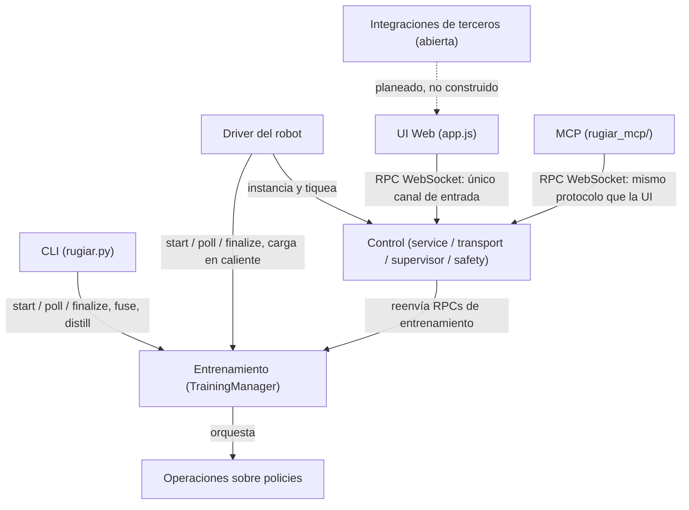
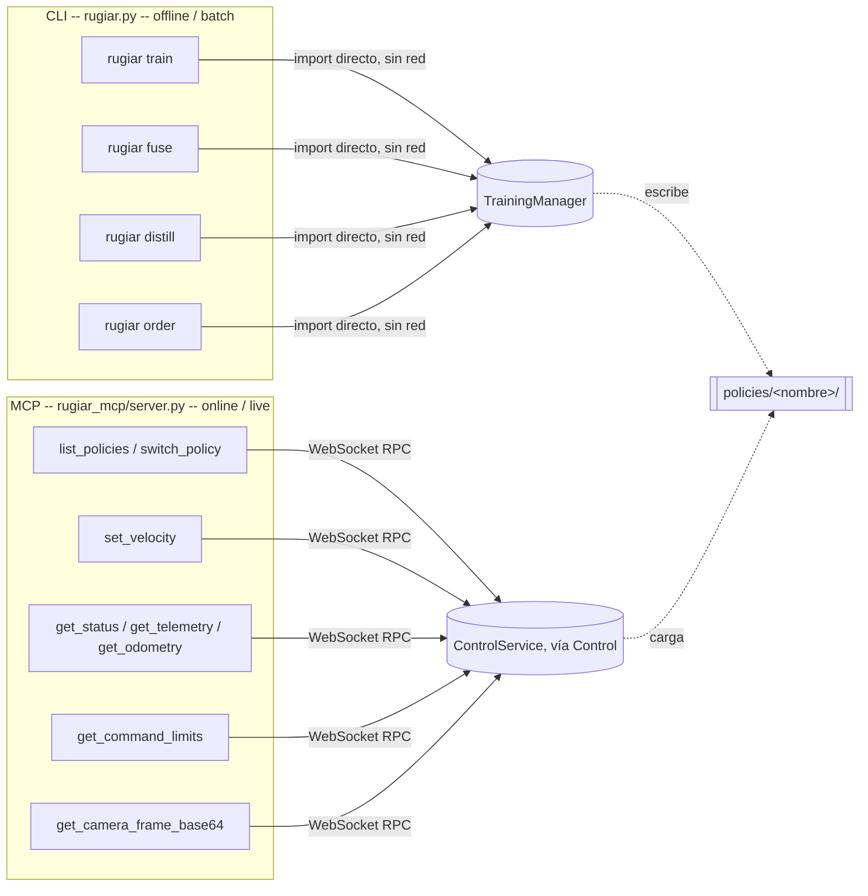

<!--
Source of truth for docs/Sumate_a_RUgiar.pdf.
This file was reconstructed from the existing (never-committed) PDF on 2026-08-19 —
the PDF predates git tracking of this doc, built live and shared directly.
Blocks marked "⚠ UPDATE NEEDED" are places where the repo has moved since the PDF
was made (Aug 12) and this file has NOT been corrected yet — confirm before regenerating the PDF.
-->

# Sumate a RUgiar.

*ROBOT UNIVERSITY GIAR · COMUNICADO ABIERTO*

## Unamos nuestro conocimiento y energía.

**GIAR** es un grupo abierto de gente que se junta a resolver, en serio, el problema de
enseñarle a caminar y moverse a un robot de patas — hoy con humanoides Unitree como banco
de pruebas concreto, con la ambición puesta más allá de un solo fabricante. **RUgiar** es
nuestra solución a ese problema: nació como fork de `unitree_rl_gym`, pero ya entrena,
transforma y opera policies de RL sobre más de un simulador, con una base sólida ya
funcionando y ocho frentes abiertos esperando a la persona indicada. Sí, vos, vos que estás
leyendo esto.

`8 áreas · elegí la tuya` &nbsp; `Ramas cortas, PR simple` &nbsp; `Arrancás hoy`

> Lo que hace atractivo este momento para colaborar es que RUgiar recién está arrancando
> en serio. Hay una base sólida — entrenamiento funcionando, control en vivo funcionando,
> las partes críticas ya cubiertas — pero todas las áreas tienen techo, desde la UI web hasta
> la integración con captura de movimiento humano. Quien entre ahora tiene margen real
> para dejar su huella, no para retocar los bordes de algo ya cerrado.
>
> Este documento es la puerta de entrada, no el manual completo. Profundidad cuando la
> necesites: el material didáctico completo, la arquitectura entera, y el skill `rugiar` para el
> uso diario del CLI y el driver.

---

## El problema que nadie terminó de resolver

*CONTEXTO · POR QUÉ ESTO IMPORTA, MÁS ALLÁ DE ESTE REPO*

Enseñarle a caminar a un robot con dos piernas dejó de ser ciencia ficción hace pocos años
— y sigue siendo, hoy, un problema abierto. No es una curva que ya se resolvió en un paper y
ahora solo falta implementar: cada equipo que lo intenta — Unitree, Boston Dynamics, Figure,
la comunidad académica detrás de Isaac Gym/Isaac Lab, los grupos que arrancaron mjlab en
DeepMind — se choca con las mismas preguntas de fondo, cada uno con su propia pila de
herramientas, casi nunca compatibles entre sí:

- **Entrenar es caro y frágil.** Un humanoide real no aprende por prueba y error contra el
  piso — se rompe. Todo el aprendizaje pasa por simulación (miles de copias virtuales de un
  robot, cayéndose millones de veces sin costo) antes de tocar hardware real. Pero cada
  simulador tiene su propia física, su propio formato de robot, sus propias mañas — y una
  policy entrenada en uno no necesariamente camina igual en otro.
- **Sim2real sigue siendo la parte que nadie garantiza.** Que algo funcione en simulación no
  prueba que funcione en el robot físico — ese salto (sim2real) es donde más proyectos se
  estancan, y donde más se necesita evidencia real, no solo una curva de reward prolija.
- **El ecosistema está fragmentado a propósito y por necesidad.** Genesis, Isaac Gym, Isaac
  Lab, MuJoCo/mjlab — no son intercambiables, cada uno resuelve un pedazo distinto del
  problema (GPU vs. CPU, licenciamiento, qué tan realista es el contacto físico, qué tan rápido
  itera un equipo chico). Ningún fork de `unitree_rl_gym`, ni el proyecto de ningún otro
  fabricante, resolvió esto de una vez y para siempre — y probablemente no hay una única
  respuesta correcta, sino una capa de orquestación que sepa moverse entre todos.
- **Entrenar una policy es solo el primer tercio del problema real.** Después viene
  fusionarlas, destilarlas, hacerlas convivir con otras, decidir cuál usar y cuándo, operarlas en
  vivo con seguridad, y — cada vez más — dejar que un agente de IA las maneje en nombre de
  un humano. Casi ningún proyecto de RL para robots piensa en ese ciclo completo desde el
  día uno; la mayoría se queda en "entrenamos una policy que camina" y ahí termina.

**Esto no es un problema de Unitree, ni un problema que empieza o termina en este repo.**
Es el mismo problema que enfrentaría cualquier equipo trabajando con cualquier robot de
patas — Go2, G1, un cuadrúpedo genérico, un humanoide de otro fabricante el día de mañana.
La solución que vale la pena construir es una que no dependa de qué robot específico tenés
enfrente.

---

> A partir de acá arranca lo nuestro: **RUgiar** es la respuesta de GIAR a ese problema —
> no "otro fork más de `unitree_rl_gym`", sino la capa que orquesta todo el ciclo (entrenar →
> transformar → operar → dejar que un agente lo use) sobre múltiples simuladores, múltiples
> robots, y múltiples formas de acceder al sistema — CLI, web, y ahora también agentes de IA
> vía MCP. Lo que sigue es el estado real de esa solución hoy, y las ocho puertas todavía
> abiertas para quien quiera construirla con nosotros.

---

## Elegí una y tomá la posta

*LAS 8 ÁREAS*

El proyecto se divide siguiendo el ciclo de vida de una policy: entrenarla → transformarla →
manejar con ella un robot. Pensadas para trabajarse en paralelo — cada una tiene dueño
potencial: vos.

### §1 · Entrenamiento
Mejorar cómo se lanzan y siguen los jobs de RL, local o en Kaggle, y el catálogo de policies
resultante.
`legged_gym/control/training.py`

### §2 · Operaciones sobre policies
Fusión de pesos, destilación / behavior cloning — hacer más policies a partir de las que ya
existen.
`fusion.py` · `distillation.py`

### §3 · Control
El motor del robot en vivo: cambio de policy, seguridad, transporte, adapters sim/real.
`service.py` · `transport.py` · `supervisor.py` · `safety.py`
ref: `examples/joystick_controller.py`

### §4 · UI Web
El panel de control en el navegador — hoy el área con más superficie visible y más margen
de crecimiento.
`web/index.html` · `web/app.js`

### §5 · CLI
La herramienta de terminal — entrenar, fusionar, destilar sin abrir un navegador. Mismo
comando para una task de locomoción (Genesis) que para una de motion-tracking (mjlab,
`Rugiar-G1-Mimic`) — el CLI detecta y despacha al backend correcto solo, vos no elegís venv
ni intérprete a mano.
`legged_gym/cli/rugiar.py`

### §6 · Driver del robot
El proceso que arma todo y corre el loop del robot, en simulación o real.
`rugiar_driver.py` · `rugiar_driver_gaze.py`

### §7 · shipped — Motion library, de captura de movimiento a policy entrenada
Lo que esta sección pedía como "terreno sin dueño" ya se construyó y está validado en vivo:
un pipeline completo que va de un dataset de motion capture externo
([g1-moves](https://huggingface.co/datasets/exptech/g1-moves), vía
`process_reference_motion_mjlab.py`) a una policy G1 full-body entrenada imitando ese
movimiento, con overlay "ghost" del movimiento de referencia superpuesto al robot en vivo en
viser, selector de clips y panel de Create Policy conscientes de mjlab en la control web, un
training backend real para mjlab (no un wrapper — puerto propio de `mjlab_train.py`), y un
panel de rewards con las 9 variables de tracking de este mundo (`motion_body_pos`,
`motion_body_ori`, etc.), streameando en vivo mientras el robot imita.
`legged_gym/scripts/process_reference_motion_mjlab.py` · `legged_gym/scripts/mjlab_train.py` ·
`docs/motion_imitation_integration.md` · `docs/mjlab_training_contract.md`

> **Frontera todavía abierta acá:** el pipeline de arriba corre sobre Genesis/mjlab (CPU/Metal,
> sin depender de NVIDIA). El stack de simuladores NVIDIA (Isaac Lab / Isaac Gym) para este
> mismo mundo de motion imitation lo está avanzando otro equipo, integración pendiente.
> Más allá de eso: sumar nuevas fuentes de movimiento — video propio digitalizado, otros
> datasets de motion capture, captura desde el robot mismo — sigue siendo terreno real para
> quien se sume. `tu nombre acá`

### §8 · shipped-parcial — MCP, para que un agente de IA maneje el robot

Existe y funciona: un servidor MCP (`rugiar_mcp/`) que expone una sesión YA CORRIENDO —
`switch_policy`, `set_velocity`, `get_status`/`get_telemetry`/`get_odometry`,
`get_command_limits`, `get_camera_frame_base64` — sobre el mismo protocolo WebSocket que
ya habla la web y `examples/joystick_controller.py`. Cualquier cliente MCP (Claude, Hermes,
otro agente) puede hoy mismo preguntarle a un robot en vivo qué está haciendo y decirle
hacia dónde moverse, sin que nadie tenga que escribir un segundo protocolo.

**La frontera real:** vive en la rama `mcp-base`, no mergeada a `main` — quedó desactualizada
respecto al trabajo de mjlab (§7). No expone NADA de entrenamiento — el CLI y el MCP se
reparten el motor de este proyecto sin pisarse: uno solo entrena (offline, nunca toca una
sesión viva), el otro solo opera (en vivo, nunca entrena) — ver el diagrama más abajo. Mergear
esta rama, ponerla al día, y decidir si conviene sumarle herramientas de entrenamiento (el
camino ya existe — Control ya reenvía esas RPCs para la web) es terreno abierto entero.
`rugiar_mcp/server.py` · `rugiar_mcp/control_client.py`

> **Antes de arrancar:** Entrenamiento produce carpetas `policies/<nombre>/` — ese
> directorio es el contrato con el resto del sistema. Control no se instancia solo, lo arma el
> Driver. La UI Web solo habla WebSocket contra Control, sin otro camino de entrada. El CLI
> no toca Control ni el Driver — cero imports, la frontera más limpia del repo. El MCP es el
> espejo del CLI: solo habla WebSocket contra Control (igual que la UI Web), cero imports de
> Entrenamiento — ninguna de las dos puertas de agente pisa a la otra.

---

## Simulación y robot real, sin reescribir nada

*POR QUÉ ESTÁ ARMADO ASÍ*

El sistema depende de un protocolo, no de Genesis ni del SDK de Unitree — por eso pasar
de simulación a robot real no debería requerir reescribir nada arriba.

> Dos cosas para saber antes de arrancar, no para frenarte: `training.py` hace bastante hoy —
> si ves una separación natural, proponela. Y `web/app.js` todavía no tiene un registro de
> paneles — si vas a sumar uno, avisá en el equipo para coordinar con quien esté tocando
> otro al mismo tiempo.

---

## Política de branching

*CÓMO TRABAJAMOS*

Lo más laxo posible. Dos reglas duras, el resto es criterio de cada uno.

**Regla dura — Nadie pisa main directo.** Todo cambio entra por rama propia.

**Regla dura — Todo se mergea por PR.** Aunque la revises vos mismo — deja registro de qué
cambió y por qué.

El resto son sugerencias, no obligaciones:

- Usá nombres de rama y mensajes de commit significativos — que cuenten algo del cambio,
  no `fix` / `wip` / `cambios`. Preferentemente en inglés, pero no es lo primordial: que se
  entienda importa más que el idioma.
- Correr los tests ayuda (`pytest tests/`, con `SIMULATOR` según tu entorno — genesis en
  Mac/CPU, puede ser isaacgym / isaaclab en otro setup), y agregar tests de lo que hagas es
  aconsejado — no exigido.
- Como norte de diseño tratamos de seguir SOLID, DRY y LEAN — no como dogma, sino
  porque es lo que permite que varias personas toquen esto en paralelo sin pisarse.
- Si tu cambio cruza dos áreas, avisar en la PR quién coordinó qué ayuda — de nuevo, criterio,
  no regla.

> Punto de partida laxo a propósito. Si el equipo crece o algo empieza a doler, se ajusta.

---

## Cómo se conectan las ocho áreas

*EL MAPA*



Leído en una frase: el Driver es el único que arma Control; Control es la puerta de entrada
tanto de la UI como del MCP; el CLI llega a Entrenamiento por un camino que nunca se cruza
con el del MCP; y todo lo que las áreas comparten en disco son las carpetas
`policies/<nombre>/`.

### CLI vs. MCP — quién maneja qué (y por qué no se pisan)

*EL DIAGRAMA QUE RESUELVE LA PREGUNTA "¿ESTO NO ESTÁ DUPLICADO?"*

Las dos puertas pensadas para que un agente/proceso externo maneje el sistema sin
navegador — CLI y MCP — a primera vista parecen candidatas a solaparse. Revisando el código
de las dos (`legged_gym/cli/rugiar.py` vs. `rugiar_mcp/server.py`), la respuesta es que no se
solapan en absoluto — cada una llega a una mitad distinta del engine, sin cruzarse:



- **El CLI nunca necesita un robot corriendo** — entrena, fusiona, destila, todo offline, y
  escribe el resultado a disco. Cero conocimiento de si hay una sesión viva en algún lado.
- **El MCP nunca entrena nada** — todas sus herramientas asumen una sesión YA corriendo y
  solo la operan (cambiar de policy, moverla, leer su estado). Cero conocimiento de
  `TrainingManager`.
- **El único punto de contacto entre ambos mundos es el filesystem** — `policies/<nombre>/`,
  el mismo contrato que conecta cualquier otra área de este mapa. Una policy que el CLI
  terminó de entrenar aparece disponible para que el MCP la seleccione en la próxima sesión
  (o en caliente, si el Driver ya la detectó — ver §Driver del robot).
- **La única puerta que sí toca ambos mundos es la UI Web** — porque Control reenvía las RPCs
  de entrenamiento que el panel "Create Policy" dispara. Si el MCP algún día necesita lanzar
  entrenamientos también, ese camino ya existe del lado de Control — hoy simplemente no está
  expuesto como tool de MCP. Extenderlo (o decidir deliberadamente no hacerlo) es parte de la
  frontera abierta de §8.

---

## A dónde ir según lo que vayas a tocar

*REFERENCIA RÁPIDA*

| Si vas a… | Empezá por | Y además |
|---|---|---|
| Entrenamiento | `training.py` | `result.json` / `progress.json` solo documentados en comentarios — buena primera mejora. |
| Operaciones sobre policies | `fusion.py` / `distillation.py` | Orquestación en `training.py` — coordiná con quien esté ahí. |
| Control | `ARCHITECTURE.md` §3, después `service.py` | Diagrama de secuencia y nota de concurrencia: lectura obligatoria antes de la primera línea. |
| UI Web | `send()`, `call()`, `applyStatus()` | Más espacio para crecer, más impacto visible, hoy. |
| CLI | `rugiar.py` | Preservá la ausencia de imports de Control/Driver. |
| MCP | `rugiar_mcp/server.py` | Empezá poniendo la rama `mcp-base` al día contra `main` — está atrasada, no rota. |
| Driver del robot | `rugiar_driver.py` | Cambios en helpers compartidos van también a `_gaze.py`. |
| Hardware real | `deploy_real/real_adapter.py` | Sin probar en robot físico — si tenés acceso a un G1, sos quien puede cerrar esa brecha. |
| Integraciones de terceros | Nada todavía | Hablá con quien hace el retargeting, o proponé vos el contrato. |

---

## Instalación, según tu sistema

*ANTES DE TU PRIMER PR*

Tres caminos según de dónde vengas: nativo en Mac/Linux, un solo comando con Docker en
cualquier sistema (incluido Windows), o Kaggle si no tenés GPU propia y querés entrenar en
la nube.

### macOS / Linux — nativo

Clonás, armás un entorno virtual de Python 3.12 e instalás las dependencias. Sin GPU no hay
problema — en Apple Silicon corre sobre CPU o Metal según lo que Genesis detecte.

```bash
# 1. clonar y entrar al repo
git clone https://github.com/josetabuyo/RobotUniversityGiar.git
cd RobotUniversityGiar

# 2. instalador de un comando (hace todo lo de abajo por vos)
./install.sh
# agregá --with-kaggle si también vas a entrenar en Kaggle:
./install.sh --with-kaggle

# 3. cada terminal nueva necesita esto:
source .venv/bin/activate
export SIMULATOR=genesis
```

> `install.sh` es nuevo: hace exactamente los pasos manuales que antes vivían solo en el
> README (venv, los `pip install` en el orden correcto, `pip install -e .`) — instalación
> equivalente, un comando menos para copiar mal. Si preferís los pasos manuales o algo falla,
> están en `README.md` §2.

### Docker Compose — más simple, cualquier sistema (recomendado)

Si no querés lidiar con Python, venvs ni versiones de dependencias — este camino ya es el
"instalador simplificado": no hay pip, no hay venv, funciona igual en Mac, Linux y Windows
(con Docker Desktop) porque todo corre adentro del contenedor.

```bash
# 1. poné tus checkpoints .pt en ./policies/ (ej: ./policies/motion.pt)
# 2. copiá el archivo de entorno de ejemplo
cp .env.sample .env

# 3. build y run — funciona en amd64 y arm64/Apple Silicon
docker compose up --build
# abrí http://localhost:9006       (visor 3D viser)
# y      http://localhost:9013      (control web unificado)
```

Requiere Docker Desktop instalado (Mac, Windows) o Docker Engine (Linux). Con GPU NVIDIA
en Linux, sumá el overlay:

```bash
GENESIS_BACKEND=cuda docker compose -f docker-compose.yml -f docker-compose.gpu.yml up --build
```

### Windows — WSL2 o Docker

No hay instalador nativo de PowerShell para el camino Python/venv — no está probado en
Windows puro y Docker ya cubre ese caso sin fricción (ver arriba). Dos opciones reales:

- La más simple: Docker Desktop en Windows (usa WSL2 como backend por dentro, no hace
  falta configurarlo a mano) y seguís el bloque de Docker Compose de arriba tal cual.
- Si querés Python nativo: instalá WSL2 con Ubuntu (`wsl --install` en PowerShell como
  administrador, después reiniciar), abrís una terminal de Ubuntu y seguís el bloque
  "macOS / Linux — nativo" de arriba sin cambios — es una terminal Linux real, mismos
  comandos, mismo `install.sh`.

> **¿Cuál elegir?** Si nunca tocaste Python o entornos virtuales: Docker. Si vas a tocar código
> de entrenamiento y querés iterar rápido sin reconstruir una imagen cada vez: nativo
> (Mac/Linux, o WSL2 en Windows).

---

## Kaggle: GPU gratis sin tener una propia

*ENTRENAMIENTO EN LA NUBE*

Entrenamiento (§1) puede lanzar jobs de RL en un kernel de Kaggle en vez de tu máquina
local. Configuración de una sola vez — después, todo `--backend kaggle` funciona directo.

1. Creá una cuenta gratis en kaggle.com si todavía no tenés una.
2. Verificá tu teléfono en kaggle.com/settings, sección Phone Verification. Es obligatorio para
   desbloquear la cuota de GPU (el free tier da ~30 horas de GPU por semana) — sin esto, los
   kernels corren solo en CPU o ni arrancan.
3. Creá un token de API: en kaggle.com/settings → sección API → botón Create New Token.
   Se descarga un archivo `kaggle.json`.
4. Instalalo localmente (Mac/Linux/WSL2):
   ```bash
   mkdir -p ~/.kaggle
   mv ~/Downloads/kaggle.json ~/.kaggle/kaggle.json
   chmod 600 ~/.kaggle/kaggle.json
   ```
5. Instalá el paquete `kaggle` (solo hace falta para este backend — si usaste
   `./install.sh --with-kaggle` ya lo tenés):
   ```bash
   pip install -e .[cloud]
   ```
6. Verificá que las credenciales se detectan:
   ```bash
   python3 -c "from legged_gym.control.kaggle_backend import kaggle_credentials_available; print(kaggle_credentials_available())"
   # debería imprimir True
   ```

> Los jobs de Kaggle corren siempre sobre Isaac Gym (no Genesis) porque el free tier asigna
> GPUs Pascal (P100), que no soportan el backend GPU de Genesis — detalle completo en
> `HANDOFF_kaggle_cloud_gpu.md`. No afecta tus corridas locales: `--backend local` sigue
> usando el `SIMULATOR` que tengas exportado.

---

## Token de control: la llave del robot

*MANEJAR UN ROBOT REAL*

Cuando el Driver corre con `--real`, el socket de control queda expuesto en la red WiFi/LAN
del robot. Un token es un secreto compartido que vos elegís — no hay que "pedirlo" a ningún
servicio, solo generarlo y usarlo consistentemente.

1. Generá un secreto aleatorio — cualquiera de estas dos formas sirve:
   ```bash
   openssl rand -hex 16
   # o, sin depender de openssl:
   python3 -c "import secrets; print(secrets.token_hex(16))"
   ```
2. Arrancá el Driver con ese token (obligatorio con `--real`, recomendado siempre que el
   puerto sea alcanzable desde más que localhost):
   ```bash
   python legged_gym/scripts/rugiar_driver.py \
       --policy stable:policies/stable/checkpoint.pt \
       --control_port 9013 \
       --real --token <tu-secreto>
   ```
3. Conectate agregando el token como query param — a la UI web, o a un cliente propio como
   `examples/joystick_controller.py`:
   ```
   ws://<host>:9013/ws?token=<tu-secreto>
   # la UI web hace lo mismo abriendo:
   http://<host>:9013/?token=<tu-secreto>
   ```
4. Compartí esa misma URL (con el token incluido) con quien vaya a construir un controlador
   propio contra el robot — es la única credencial que necesita.

> Sin `--token`, el handshake se acepta de cualquiera en la red del robot — sin secreto, sin
> login, sin nada. Es aceptable solo para una sesión de simulación local y de confianza
> (localhost); nunca para `--real`. Detalle completo del protocolo: `docs/index.html` §13.

---

## Hacia dónde va esto

*VISIÓN*

Ningún robot con patas hoy tiene un "sistema operativo" real — algo que entrene su
comportamiento, lo transforme, lo opere con seguridad, y lo deje disponible para que un
humano o un agente de IA lo maneje, todo bajo una misma capa coherente, sin importar
sobre qué simulador nació ni sobre qué hardware termina corriendo. Lo que existe hoy —
acá y en cualquier otro proyecto del ecosistema — son piezas sueltas: un fork que entrena
bien, un protocolo que controla bien, un dataset de motion capture por un lado, un servidor
MCP experimental por otro, cada uno resolviendo su pedazo sin hablarle al resto.

**Eso es exactamente lo que RUgiar ya empezó a ser, y lo que se propone terminar de ser:**
el alma del robot — no el chasis, no los motores, sino la capa que decide cómo se mueve,
cómo aprende a moverse mejor, y quién (humano o agente) tiene permiso de decírselo en cada
momento. Genesis y mjlab hoy, Isaac Lab/NVIDIA mañana, cualquier robot de patas que llegue
después — no porque haya que soportar todo a la fuerza, sino porque la capa de orquestación
en el medio (`TrainingManager`, `ControlService`, el protocolo, ahora CLI y MCP como puertas
de entrada) ya está pensada para no romperse cada vez que cambia lo que hay debajo o arriba.

La ambición no es "otro fork mejor" — es que dentro de un tiempo, cuando alguien piense en
entrenar y operar un humanoide, RUgiar sea la respuesta obvia, sin importar de qué fabricante
sea el robot. Eso no lo construye una persona ni un fin de semana — se construye área por
área, PR por PR, con quien se sume ahora mientras las ocho puertas siguen abiertas.

---

Elegí un área, abrí una rama, y arrancá. Que ruja.

*Si algo de este documento quedó viejo apenas empieces — arreglalo vos mismo. Es,
literalmente, el primer PR ideal.*
